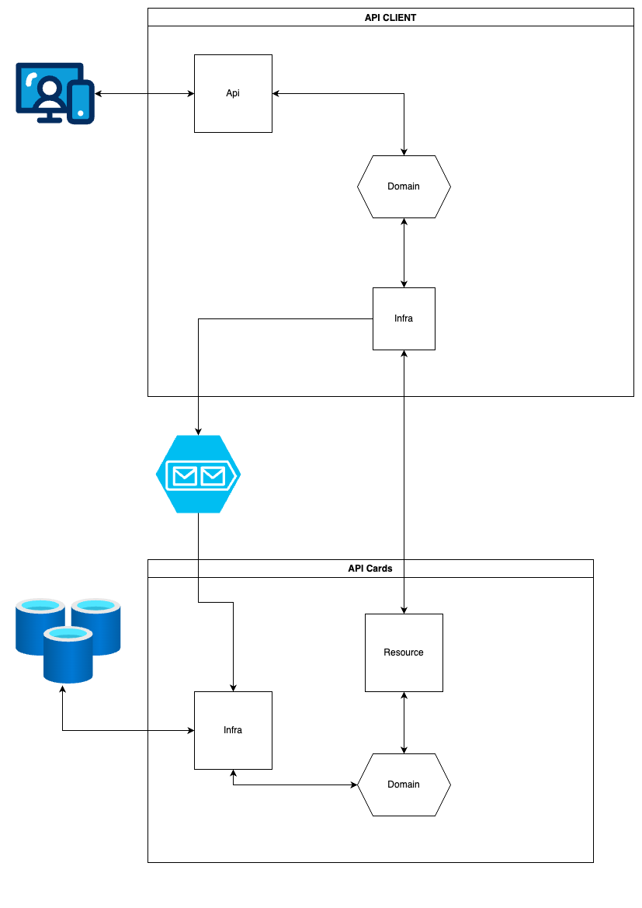

## API Client (Desafio)

### Requisitos para rodar o projeto

1. [JAVA 21.](https://www.oracle.com/java/technologies/downloads/#java21)
2. [Release do SpringBoot - 3.4.4](https://spring.io/blog/2025/03/20/spring-boot-3-4-4-available-now)
3. [*Redis](https://redis.io/downloads/)
4. [*RabbitMQ](https://www.rabbitmq.com/)
4. [Gradle](https://gradle.org/install/)
5. [Git (opcional).](https://git-scm.com/)
   6[Postman](https://www.postman.com/) ou [Insomnia](https://insomnia.rest/download) ou [CURL](https://www.alura.com.br/artigos/curl-como-usar?srsltid=AfmBOoo6DhmK9UMwDHV8YKzA3ZqGfRIOrMw2uNfqPngxjAM4WFmiJjlL) (opcional).

### Estrutura criada

1. Criado duas API's na linguagem [Kotlin](https://kotlinlang.org/) com [Spring Boot](https://spring.io/guides/gs/spring-boot/)
2. Adicionado Endpoints documentados com [Swagger](https://swagger.io/tools/swagger-ui/).
3. Foi utilizado Arquitetura Hexagonal
4. Adicionado filas para processar as ofertas de cartões baseados na regras do cliente.
5. Foi utilizado o Docker para usar RabbitMQ e o REDIS. Na tabela abaixo está o repo para usar, se preferir.
### Projetos no Github

| Projeto    | Repositório                                     |
|------------|-------------------------------------------------|
| api-client | https://github.com/alexsantossilva/api-client   |
| api-cards  | https://github.com/alexsantossilva/api-cards    |
| docker     | https://github.com/alexsantossilva/docker-cards |


### Dashboards adicionados no Docker Compose

1. Dado que esteja rodando os dois projetos em ambiente local.

| Recursos           | URL                                          | Usuário | Pass   |
|--------------------|----------------------------------------------|--------|--------|
| RabbitMQ Dashboard | http://localhost:15672/                      | guest  | guest  |
| Swagger api-client | http://localhost:8080/swagger-ui/index.html  |        |        |


## Como rodar o projeto


1. Clonar o projeto:
```
$ cd ~
$ mkdir project
$ cd project
$ git clone https://github.com/alexsantossilva/api-client.git
$ git clone https://github.com/alexsantossilva/api-cards.git
```

3. Rodando os projetos:
```
$ ./gradlew build
$ ./gradlew bootRun
```

4. Acesse: http://localhost:8080/swagger-ui.html

### Desenho Solução


